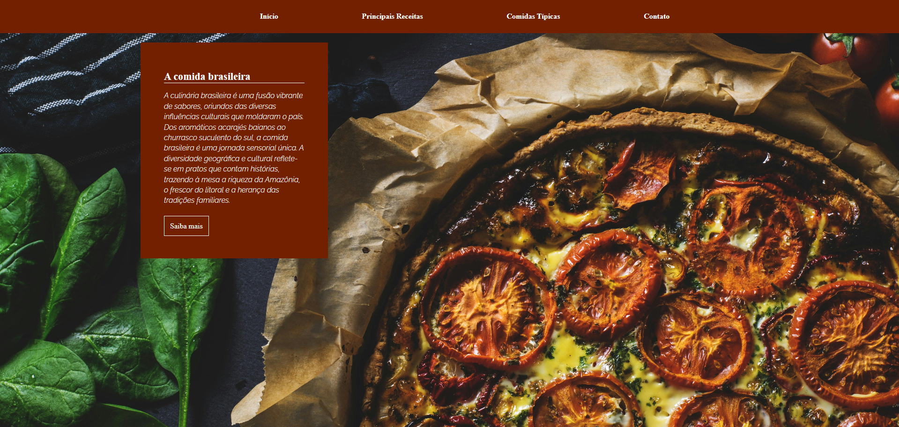

# 🍽️ Landing Page - Culinária Brasileira

Landing page dedicada à **culinária brasileira**, apresentando receitas e comidas típicas de forma visual e interativa. O projeto destaca pratos tradicionais como o **Lombo Recheado com farofa, presunto e queijo**, além de referências visuais a ícones brasileiros como o **Cristo Redentor**.

## 📸 Preview

 

## 🚀 Demonstração


🔗 [Acesse o site](https://rochacode08.github.io/culinaria-br/)

## 🛠️ Tecnologias utilizadas

- **HTML5** — estruturação semântica da página
- **CSS3** — estilização com variáveis CSS (`:root`) e Flexbox
- **Bootstrap Grid** — sistema de grid responsivo
- **Google Fonts** — tipografia com a fonte *Raleway*

## ✨ Funcionalidades

- ✅ Layout responsivo para Desktop, Tablet e Mobile
- ✅ Menu de navegação fixo no topo
- ✅ Hero section com imagem de destaque e chamada para ação
- ✅ Seção de receitas com ícones ilustrativos
- ✅ Seção de comidas típicas com background temático
- ✅ Rodapé completo com formulário de contato e redes sociais
- ✅ Paleta de cores customizada usando **CSS Variables**

## 🎨 Paleta de cores

O projeto utiliza uma paleta quente inspirada nas cores da culinária brasileira:

| Cor           | Hex       |
| ------------- | --------- |
| 🟡 Yellow     | `#F0B504` |
| 🟠 Orange     | `#F1A104` |
| 🟤 Skin       | `#F1BB76` |
| 🟧 Dark Orange| `#A85102` |
| 🟥 Wine       | `#732001` |
| 🍷 Dark Wine  | `#511600` |

## 📂 Estrutura do projeto

```
📦 landing-page-culinaria
 ┣ 📂 css
 ┃ ┣ 📂 bootstrap
 ┃ ┃ ┗ 📜 bootstrap-grid.min.css
 ┃ ┣ 📜 colors.css     → Variáveis de cores do projeto
 ┃ ┣ 📜 index.css      → Estilos principais do site
 ┃ ┣ 📜 main.css       → Arquivo central que importa os demais CSS
 ┃ ┣ 📜 mobile.css     → Media queries e responsividade
 ┃ ┗ 📜 style.css      → Estilos gerais
 ┣ 📂 images
 ┃ ┗ 🖼️ (Pizza, Cristo-RJ e demais imagens)
 ┗ 📜 index.html        → Página principal
```

## 📱 Responsividade

O projeto conta com múltiplos breakpoints seguindo o padrão do Bootstrap:

| Dispositivo       | Largura máxima |
| ----------------- | -------------- |
| 📱 Mobile         | até 576px      |
| 📱 Tablet         | até 768px      |
| 💻 Desktop pequeno| até 992px      |
| 💻 Desktop        | até 1200px     |
| 🖥️ Desktop grande | até 1400px     |

## 💻 Como rodar o projeto

Clone o repositório:

```bash
git clone https://github.com/rochacode08/culinaria-br.git
```

Acesse a pasta do projeto:

```bash
cd culinaria-br
```

Abra o arquivo `index.html` no navegador — ou utilize a extensão **Live Server** do VS Code para recarregamento automático durante o desenvolvimento.

## 📚 O que eu aprendi

Este projeto fez parte dos meus estudos iniciais em desenvolvimento web. Durante sua construção, pratiquei:

- Estruturação semântica com HTML5
- Organização de arquivos CSS em **módulos** (colors, index, mobile, main)
- Uso de **CSS Variables** (`:root`) para manter a paleta de cores consistente
- Integração com o **Bootstrap Grid System**
- Criação de layouts com **Flexbox**
- Uso de `background-image` com sobreposição de cores (`rgba`)
- Estilização de formulários customizados (inputs transparentes com borda inferior)
- Aplicação de `transition` para criar efeitos suaves em hover
- Media queries para diferentes tamanhos de tela

## 🔮 Melhorias futuras

- [ ] Implementar funcionalidade real no formulário de contato (envio via backend)
- [ ] Adicionar uma página individual para cada receita
- [ ] Criar animações de scroll
- [ ] Adicionar mais pratos típicos brasileiros
- [ ] Incluir um sistema de busca de receitas

## 📝 Licença

Este projeto foi desenvolvido apenas para fins **educacionais e de estudo**.

---

## 👨‍💻 Autor
Desenvolvido com 💙 por **[Gabriel Rocha Lopes](https://github.com/rochacode08)**

<a href="mailto:gabrielrocha.devstack@gmail.com">
    
</a>
<a href="https://www.linkedin.com/in/gabriel-rocha-devstack">
    
</a>
<a href="https://www.instagram.com/gabriel_lopess15/">
    
</a>

---